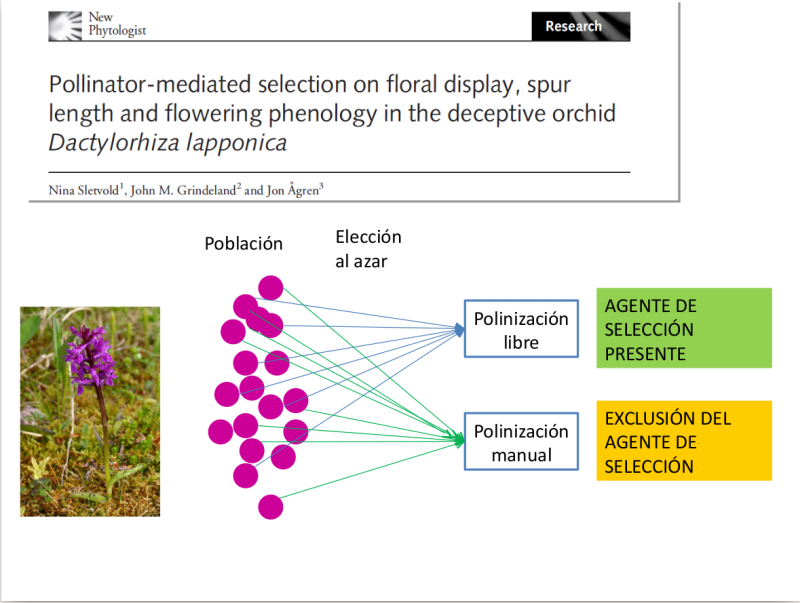

```{r setup, include=FALSE}
knitr::opts_chunk$set(echo = TRUE)
```


## {data-background="images/darwin_fondo.png"}

<small> ¿Puede considerarse improbable, dado que indudablemente se han producido variaciones útiles para el hombre, que otras variaciones útiles ... deberían a veces ocurrir en el curso de miles de generaciones? Si esto ocurre, ¿podemos dudar (recordando que nacen muchos más individuos de los que posiblemente pueden sobrevivir) que los individuos que tienen alguna ventaja, por pequeña que sea, ... tendrían la mejor oportunidad de sobrevivir y de procrear su especie? Por otro lado, podemos estar seguros de que cualquier variación en el menor grado de daño sería destruida rígidamente. **Esta preservación de variaciones favorables y el rechazo de variaciones perjudiciales, lo llamo Selección Natural**. </small>

##


 <small> Darwin 1872 </small>

##

> A medida que ciertas polillas de Madagascar se volvían más grandes a través de la selección natural (...) o sólo su probóscis se volvía más larga para alcanzar el néctar de de *Angraecum* y otras flores tubulares, aquellas plantas de *Angraecum* que tuvieran los nectarios más largos (...) y que, por tanto, obligan a las polillas a insertar sus probóscides hasta la misma base, serían fertilizadas. Estas plantas producirían más semillas y las plántulas podrían, generalmente, heredar nectarios más largos

## {data-background="images/darwin_fondo.png"}

* Variaciones heredables.   
* Reproducción diferencial.

## {data-background="images/darwin_fondo.png"}   

* **Agente de selección** Polinizadores de *Angraecum* (otros organismos, factores abióticos, etc.)      
* **Blanco (target) de selección** Espolones de la flor (rasgos fenotípicos en general)   

## Un poco de historia...

Gregor Mendel (1865)   


## Síntesis Moderna 

   
<small>Fisher (1918) The Correlation Between Relatives on the Supposition of Mendelian Inheritance</small>

## 

<section data-background-iframe="https://santiagombv.shinyapps.io/complextraits/"></section>

##

https://santiagombv.shinyapps.io/complextraits/    

```{r, eval=FALSE}
library(shiny)
runGitHub("complex.traits", "santiagombv")
```

## Selección sobre caracteres cuantitativos

Ecuación de los criadores univariada   

$$\Delta \bar{z} = h^2s$$  
   
+ $\Delta \bar{z}$ cambio en la media poblacional o *respuesta a la selección*   
+ $h^2$ *heredabilidad*      
+ $s$ *diferencial de selección lineal*

## 

<section data-background-iframe="https://santiagombv.shinyapps.io/selection-heritability/"></section>

## 

https://santiagombv.shinyapps.io/selection-heritability/   

```{r, eval=FALSE}
library(shiny)
runGitHub("selection-heritability", "santiagombv")
```


##

### En este curso vamos a centrarnos en los métodos para estimar estos tres aspectos   

* La respuesta a la selección, que es un cambio de una generación a la siguiente.   
* La selección fenotípica, que estimamos a partir del éxito reproductivo diferencial de individuos con diferentes características.   
* La heredabilidad, que estimamos a partir del parecido entre individuos relacionados por su parentesco.   

## Selección univariada  

$$s_{i} = cov(w, z)$$   

> la selección sobre un rasgo es igual a la covarianza entre ese rasgo ($z$) y la adecuación  relativa ($w$, *fitness*).   

##

**¿Qué sucede cuando tenemos más de un rasgo?**

## Selección multivariada.

Lande & Arnold (1983). The measurement of selection on correlated characteres.   
  
> (…) selection  on  a particular trait produces not  only  a  direct effect  on  the  distribution of  that  trait in  a population,  but  also  produces indirect  effects  on  the  distribution  of  correlated characters. The  problem of  character correlations  has  been  largely  ignored  in  current methods for measuring natural selection  on  quantitative  traits.  Selection  has usually  been  treated as  if  it  acted  only  on single  characters. 

## Gradientes de selección

<div class="red2"> 
$$w = \alpha + \sum{\beta_{i}z_{i}} + 1/2\sum{\gamma_{ii}z^2_{i}} + \sum\sum{\gamma_{ij}z_{i}z_{j}} + \epsilon$$
</div> 

$\beta_{i}$ lineal o direccional  
$\gamma_{ii}$ no lineal, estabilizadora/disruptiva  
$\gamma_{ij}$ no lineal, correlacional  

Expresan cambios de naturaleza multivariada en la media, la varianza y la correlación de los rasgos.

##


##


##


##

<section data-background-iframe="https://santiagombv.shinyapps.io/sel_gradients/"></section>

## 

https://santiagombv.shinyapps.io/sel_gradients/    

```{r, eval=FALSE}
library(shiny)
runGitHub("sel_gradients", "santiagombv")
```

## ¿Qué necesitamos para estudiar selección fenotípica en la naturaleza?  

### Requerimientos técnicos   

* Población con suficientes individuos   
* Medición de rasgos fenotípicos   
* Estimación de la adecuación   
* Ajuste de modelos   

## ¿Qué necesitamos para estudiar selección fenotípica en la naturaleza?  

### Hipótesis adaptativa   

* Establecer relaciones **causales**
  + Manipulación del **agente**   
  + Manipulación del fenotipo   
  + "Experimentos naturales"   
  + Réplicas temporales o espaciales   


## Algunos ejemplos


<small> Benitez-Vieyra *et al.*, *Func. Ecol.* 2006; Benitez-Vieyra *et al.*, *Evol. Ecol.* 2012 </small> 

##


<small> Pauw *et al.* *Evolution* 2009 </small> 

##



<small> Sletvold *et al.* *New Phyto* 2010; *Ecology* 2011; 2012; *Evolution* 2016 </small>


## END {data-background=#9dc462}