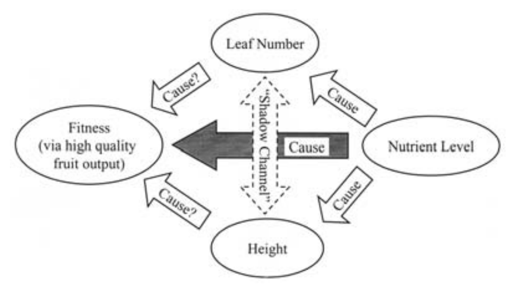
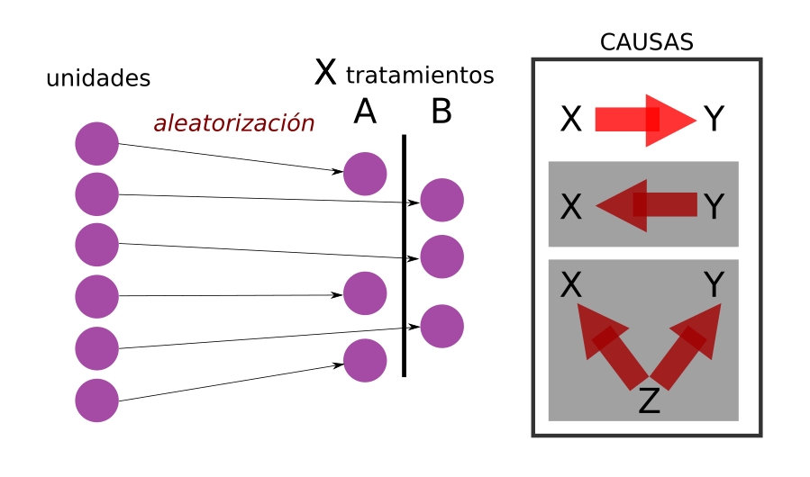
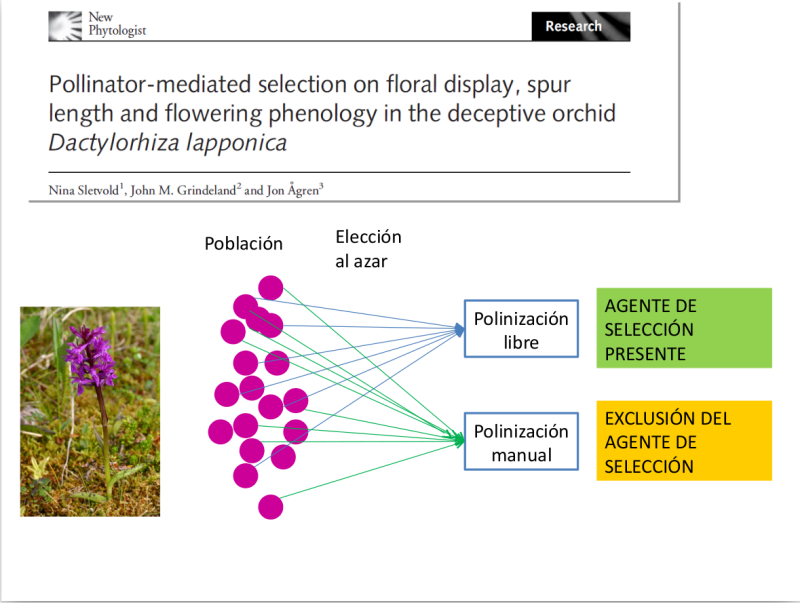
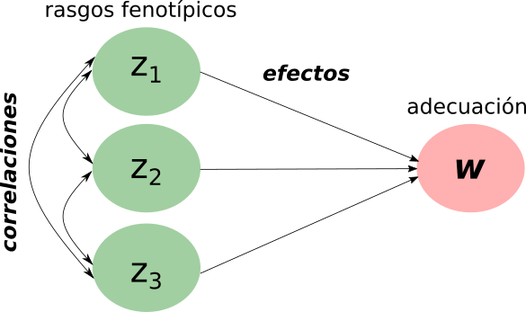
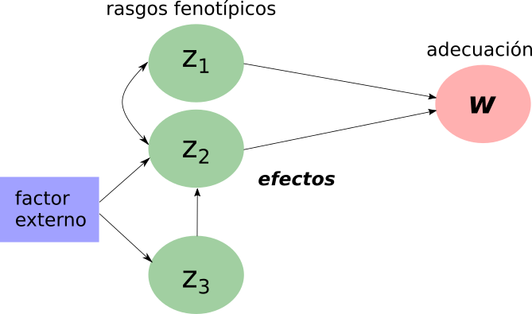
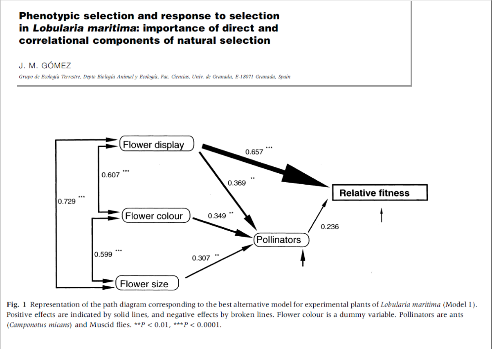

```{r setup, include=FALSE}
knitr::opts_chunk$set(echo = TRUE)
```

## 

### Ventajas del modelo de Lande y Arnold   

* Extensión multivariada de la ecuación de los criadores.   
* Aplican una técnica conocida (regresión múltiple).   
* Gradientes como aproximaciones a la superficie de selección.   
* Posibilidad de predecir la respuesta a la selección a corto plazo.   

## 



##

Mitchell-Olds y Shaw (1987) afirman que el método de Lande y Arnold es:    

* Inherentemente observacional.   
* Revela los efectos de la selección en los caracteres.   
* No puede establecer que las diferencias en adecuación son causadas por las
diferencias en los caracteres.   
* Es principalmente una herramienta que sugiere hipótesis.   

##

### CORRELACIÓN ≠ CAUSACIÓN   
* La **correlación** implica una estructura causal sin resolver   
* La **causación** implica una estructura de correlación completamente resuelta   

##


##

> Fácil es construir diez falsas filosofías sobre los datos del universo.   

<div style="text-align: right">G. K. Chesterton   
escritor de novelas policiales</div> 

##

Diseño aleatorizado (R.A. Fisher)



##

Ejemplo de tratamientos A sin fertilizante, B con fertilizante.   

* El fertilizante causa diferencis en la cosecha.   
* La cosecha causa diferencias en el fertilizante.   
* La aleatorización asegura que el orden en que se recibe el tratamiento sea independiente de cualquier atributo del suelo o de la planta.   

##  



##  

Efectos y correlaciones en el modelo de Lande y Arnold



##  

¿Porqué no pensar que existe otra relación causal entre las variables?

   

##

> Si planteamos una estructura causal, podemos estimar que tan bien encaja la estructura de correlación observada con la predicha por nuestra hipótesis.   

* Path analysis (análisis de sendero)   
* Structural Equation Modelling (modelado de ecuaciones estructurales)   

## 


