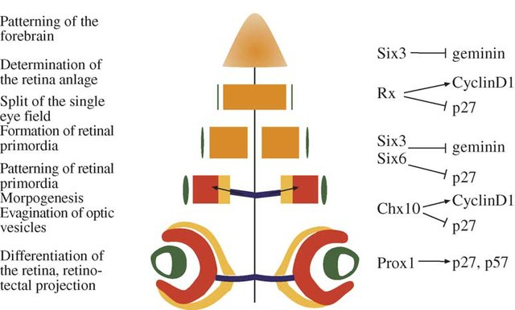
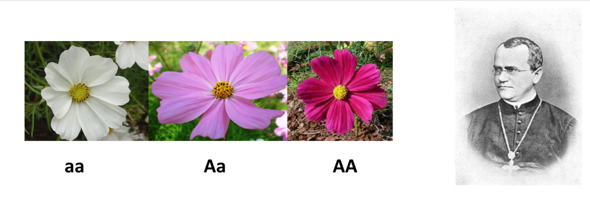
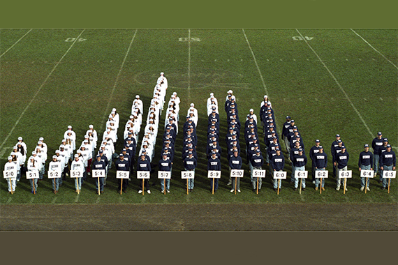
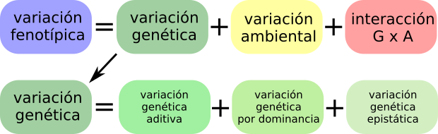
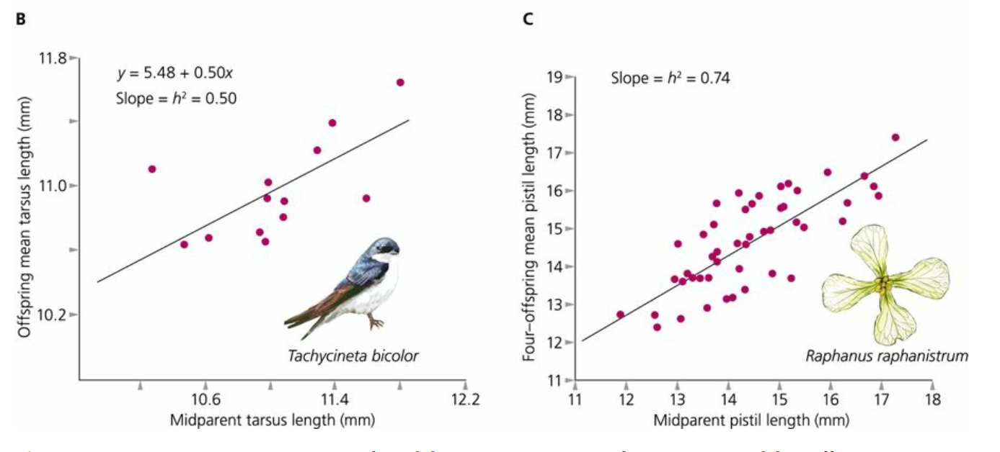
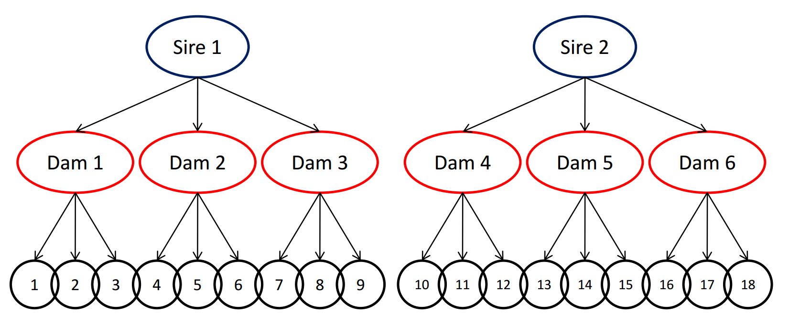
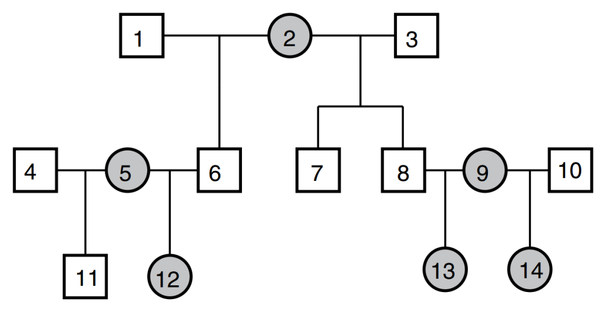
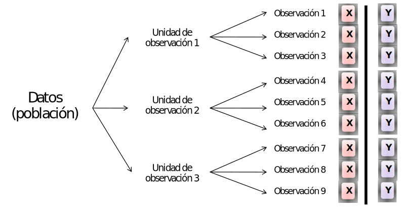

```{r setup, include=FALSE}
knitr::opts_chunk$set(echo = TRUE)
```

## ¿Por qué es importante la heredabilidad?   

selección + herencia = evolución   
   
$$R = h^2 s$$   
$$\Delta z = G \beta$$ 

<small> $h^2$ es el símbolo de heredabilidad, no significa que se eleve al cuadrado </small> 

##  Heredabilidad NO ES herencia

  

<small> Aunque conocemos muy bien los genes involucrados en el desarrollo de los ojos, la $h^2$ para el número de ojos es pŕacticamente 0. No hay variabilidad en el número de ojos. </small>   

## 

   

## 

<section data-background-iframe="https://santiagombv.shinyapps.io/complextraits/"></section>

## 

> A diferencia de la genética de poblaciones, que usualmente trabaja con frecuencias alélicas para un solo locus con dos alelos, la genética cuantitativa trabaja con varianzas. La genética cuantitativa no requiere información sobre cuáles y qué tipode genes están involucrados. En cambio, supone que hay un gran número (en la práctica infinito) de genes involucrados, cada uno de ellos con un efecto pequeño (modelo infinitesimal).    

##

   

<small> fotografía Linda Strausbaugh, University of Connecticut. </small>   

##


##


$$ \sigma^2_P = \sigma^2_G + \sigma^2_E + \sigma^2_{GE}$$

**Heredabilidad en sentido amplio**   

$$H^2 = \sigma^2_G / \sigma^2_P$$

##



$$ \sigma^2_P = \sigma^2_A + \sigma^2_{D} + \sigma^2_{I} + \sigma^2_E + \sigma^2_{GE}$$

**Heredabilidad en sentido estricto**   

$$h^2 = \sigma^2_A / \sigma^2_P$$

## 

* Cuando los efectos de los alelos son **aditivos**, influencia el fenotipo con independencia de otros alelos. Actúan independientemente unos de otros. Debido a esto, las diferencias en el fenotipo debidas a efectos aditivos son transmitidas a la descendencia. Los efectos aditivos causan la similitud entre parientes y contribuyen a la respuesta evolutiva a la selección.   

* Los efectos de dominancia y epistasis resultan de interacciones entre alelos: con su alelo hermano (dominancia) o con alelos de otros loci  en el genoma (epistasis). Estos efectos son por lo tanto dependientes del contexto (genotipo), pero este contexto se disuelve en cada generación, debido a la meiosis.   

## 

### cosas a tener en cuenta...   
* La heredabilidad es una propiedad poblacional.   
* La heredabilidad es distinta en distintos ambientes.   
* La heredabilidad NO es constante.   
* Heredabilidades altas NO implican determinismo genético.   
* La heredabilidad NO informa sobre diferencias entre grupos.   

## {data-background=#e1f4a2}   

### ¿Cómo estimar la heredabilidad? 

##

**Regresión padres - hijos y experimentos de selección artificial.**



$$ \beta = \Delta y / \Delta x $$
$$ \beta = R / s = h^2$$

##  

**Cruzamientos controlados**



Extraer los componentes causales de la varianza mediante *modelos mixtos*   

##  

**Modelo Animal**   

 

Extraer los componentes causales de la varianza mediante un *modelo mixto con información sobre el pedigree.*

## {data-background=#e1f4a2}   

### Modelos Mixtos


##  

Modelos sencillo, pseudorréplicas por familia   

 

##

$$Y_i = X_i \beta + Z_i b_i + \epsilon_i $$   

* efecto de *factores fijos* $X_i\beta$   
* efecto de las unidades de observación (ej. familias), *efecto random* $Z_ib$ 

##  

$$\epsilon \sim N(0, \Sigma)$$   
$$Y_i \sim N(X_i\beta, V) $$   

* Esta matriz **V** permite manejar el hecho de que las $Y$ no son independientes.   
* Las $Y$ provenientes de una misma unidad de observación están correlacionadas.   
* Las $Y$ de distintas unidades de observación son independientes.   

##  

Aplicando a un modelo animal o de cruzamientos controlados...   

  

<small> Wilson et al. 2010 Journal of Animal Ecology 79, 13–26 </small>  

## END
 

  


