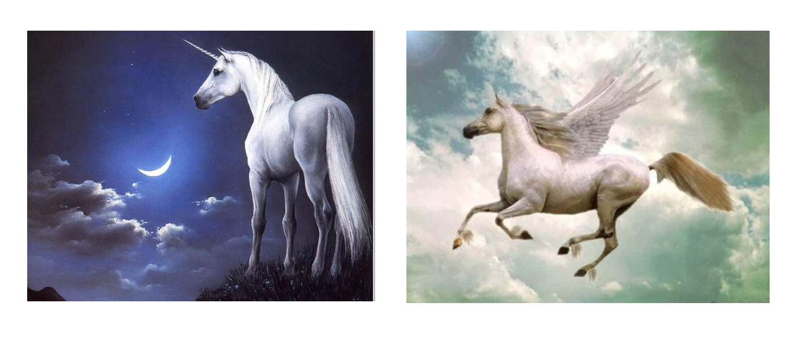

```{r setup, include=FALSE}
knitr::opts_chunk$set(echo = TRUE)
```

## 

¿Si hay selección entonces por qué suceden estas cosas?   


## 

* Existe variabilidad genética en la mayoría de las poblaciones naturales   
  + $h^2$ elevadas   
  + respuesta a la selección artificial   
* La selección en la naturaleza es fuerte   
  + revisión de estudios de selección fenotípica   
  + presencia de adaptación local   
  + evolución rápida   
  
> ¿Porqué no se agota la variabilidad genética? ¿Por qué la tasa de evolución es generalmente tan lenta?   
  
##

Entonces, ¿qué limita la respuesta a la selección?    

* El carácter que medimos puede no existir... más que en nustra imaginación.   
* Las mutaciones adecuadas pueden ser raras.   
* Pueden existir *correlaciones genéticas* con otro carácter. Estructura de la matriz **G**.   

##

$$\mathbf{\Delta z} = \mathbf{G} \boldsymbol{\beta}$$    

$$\begin{bmatrix}
\Delta z_1\\
\Delta z_2\\
\Delta z_3 
\end{bmatrix} = \begin{bmatrix}
var_1 & cov_{1,2}  & cov_{1,3} \\ 
cov_{2,1} & var_2  & cov_{2,3}\\ 
cov_{3,1} & cov_{3,2} & var_3
\end{bmatrix} \times \begin{bmatrix}
\beta_1\\
\beta_2\\
\beta_3 
\end{bmatrix}$$ 


> De la misma forma que los elementos diagonales de G miden la capacidad de un carácter para responder a la selección (varianza genética aditiva), los elementos fuera de la diagonal miden en qué grado la evolución de un rasgo es acelerada o retardada por su coevolución con otro rasgo.   

## 


```{r}
B <- c(0.2, 0.2, 0.2)
G <- matrix(c(1.0, 0.1, 0.1,
              0.1, 1.0, 0.1, 
              0.1, 0.1, 1.0), 3, 3)
G%*%B
```

##


```{r}
B <- c(0.2, 0.2, 0.2)
G <- matrix(c(1.0, 0.5, 0.1,
              0.5, 1.0, 0.2, 
              0.1, 0.2, 1.0), 3, 3)
G%*%B
```

##


```{r}
B <- c(0.2, 0.2, 0.2)
G <- matrix(c(1.0, -0.9, 0.1,
              -0.9, 1.0, 0.2, 
              0.1, 0.2, 1.0), 3, 3)
G%*%B
```

##

### Adaptive Landscapes


##


> Una matriz con correlaciones genéticas altas ve restringida su respuesta a la selección . La evolución ocurre en las **líneas de mínima resistencia genética**. (Dolph Schluter)   

##

### Evolvability   

*Habilidad de las poblaciones para evolucionar en la dirección de la selección.*   
Para un rasgo la evolvabilidad puede ser definida en forma operativa tanto en términos absolutos como condicionales, dependiendo si consideramos el resto de los
rasgos sujetos a selección estabilizadora o no. (Hansen & Houle 2008).   

## {data-background=#e1f4a2}   

### Métodos para estudiar las matrices **G**

* despomposición espectral  (CPC)   
  + constricciones absolutas   
  + constricciones relativas   
* respuesta a la selección (selection skewers)   

## 

### A través de su estructura   

La mayoría se basa en estudiar la geometría de G a través de la *descomposición espectral*. En ese caso:   

* Los EIGENVECTORES establecen el sistema de coordenadas de G.   
* Los EIGENVALORES representan la variabilidad en cada uno de los ejes
de G.   

$$\mathbf{G} = \lambda_1 e_1 e^T_1 + \lambda_2 e_2 e^T_2 + \lambda_3 e_3 e^T_3 + ...$$

##

1. Determinar la existencia de constricciones absolutas  


> uno de los eigenvalores es cero

## 

2. Intensidad de las constricciones relativas   

* Dispersión de los eigenvalores (*integración*): cuanto menor varianza de $\lambda$, más esférica es **G** y presentará una menor constricción.

   

## 

### A través de su efecto en la respuesta a la selección

Ángulo entre $\Delta z$ (la respuesta a la selección) y $\beta$ (la selección lineal), real o simulada.   

  

## 


##


## {data-background=#e1f4a2}   

### La matriz **G** también evoluciona

## 

### Deriva   

Se espera que la reducción en el tamaño poblacional ocasione una *disminución proporcional* en todos los elementos de **G**.   

##

### Selección   

Se espera que la matriz **G** se alinee con la dirección de la selección, por lo que esperamos un *cambio en su orientación*.   

##  

### Mutación 

Se espera que la evolución a largo plazo de **G** esté dominada por el matrón de mutaciones pleiotrópicas (matriz **M**).   

##  

¿Cómo resuelve la evolución un problema con sai infinitas dimensiones?   

   

##  

### La gran respuesta: Modularidad!   

   

## {data-background=#e1f4a2}   

### Algunas consideraciones adicionales   

## 

* **G** es una medida local, propia de una población y cierto ambiente.   
* A lo largo de la evolución cambian las frecuencias génicas, ergo **G** también cambia.   
* **G** es una matriz de correlación. Algo causa las **G** que observamos (pensemos en el problema similar de determinar las causas de la selección).   

##   

* Todo rasgo es producto de múltiples causas. La dicotomía genes / ambiente es sólo una de las forma de dividirlas.   
* Un organismo hereda una gran cantidad de recursos que interactúan para construir el ciclo de vida del organismo.   
* El desarrollo es una construcción de los rasgos.   
* La evolución es un proceso de interacción entre el organismo y el ambiente.   

> Las cascadas de desarrollo son los principales responsables de las correlacione observadas entre los rasgos.   

##  

* Constricciones genéticas impuestas por la arquitectura génica del sistema de desarrollo.   
* Constricciones debidas a la selección natural interna (para mantener la coherencia interna en el desarrollo)   

   

## 

   

## END 


